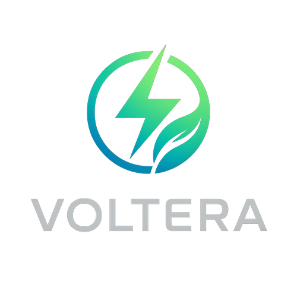

<div align="center">



# VoltEra Nexus

### The Energy Consciousness Protocol

An interactive digital-art experience connecting clean energy, decentralized
infrastructure and speculative technology.

[](https://nextjs.org/)
[](https://www.typescriptlang.org/)
[](LICENSE)
[](https://github.com/Samurai33/VoltEra-Nexus-The-Energy-Consciousness-Protocol/actions/workflows/ci.yml)

</div>

## Overview

VoltEra Nexus is a responsive gallery and product-storytelling experiment built
around 13 energy-themed digital artworks. The experience organizes the collection
into three narrative phases and uses motion, search and filtering to explore the
relationship between energy, networks and digital sovereignty.

## Experience highlights

- 13 original energy-themed artworks
- Three narrative phases: Light, Network and Subnet
- Search and phase-based filtering
- Persistent local favorites
- Animated artwork modals
- Responsive dark interface
- External marketplace-link support

## Technology

`Next.js 14` · `React 18` · `TypeScript` · `Tailwind CSS` · `Framer Motion`

## Run locally

```bash
git clone https://github.com/Samurai33/VoltEra-Nexus-The-Energy-Consciousness-Protocol.git
cd VoltEra-Nexus-The-Energy-Consciousness-Protocol
npm install
npm run dev
```

Validation:

```bash
npm run type-check
npm run build
```

## Project scope

This repository is a creative technology and interface project. References to
decentralized energy, Web3 infrastructure or environmental impact express the
project's speculative narrative; they do not represent deployed infrastructure,
investment products or verified environmental outcomes.

## Related work

- [VoltEra product and architecture dossier](https://github.com/Samurai33/voltera)
- [GreenPulse operational dashboard](https://github.com/Samurai33/GreenPulse)

## Community

- [Contributing guide](CONTRIBUTING.md)
- [Security policy](SECURITY.md)
- [Changelog](CHANGELOG.md)

## License

Released under the [MIT License](LICENSE).
